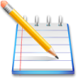

# 🌎 HELLO WORLD 🌎

Estou aqui apenas para deixar registrado
algo que com certeza vou melhorar por ora e isso

>"⁠No sistema do Divino Programador sou uma nanopartícula"

**Bem vindo ao meu perfil GitHub** 👋

Me chamo _Mariah_ tenho 20 anos e estou me desenvolvendo nese mundo imersivo por hora vou melhorar para poder postar no GitHub

  
   

## ⛓️Links Validos 

| TITULO | LINKS VALIDOS
|---|--- | 
| 📚Docs markdown  | [Sintaxe básica de gravação](https://docs.github.com/pt/get-started/writing-on-github/getting-started-with-writing-and-formatting-on-github/basic-writing-and-formatting-syntax)
| 💻Editor online | [Read.so](https://readme.so/pt/editor)
| 📝Notion anotação | [Minhas anotação](https://www.notion.so/Git-e-GitHub-d920764fa20743d6806e42828d70657c)

> [!TIP]
> Anotações são uma otima forma de lembrete

## Hobbies: 
 

